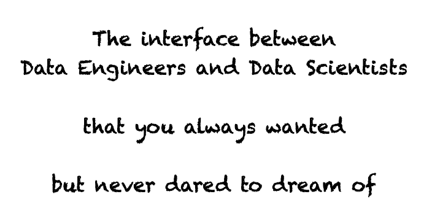

# Data as Code

<div align="center">
  
</div>

Data as Code (DaC) is a paradigm of distributing versioned data as code. Think of it as treating your data with the same
care and precision as your software.

!!! warning "Disclaimer"

    At the moment, we're focusing on tabular and batch data, with Python as the primary language.

    But who knows? With enough community interest, we might expand to other areas in the future!

## Consumer - Data Scientist

??? info "Follow along"

    Want to try the examples below on your own machine? It's easy! Just configure `pip` to point to the PyPI registry where
    the example DaC package is stored. Run this command:

    ```shell
    ❯ export PIP_EXTRA_INDEX_URL=https://gitlab.com/api/v4/projects/43746775/packages/pypi/simple
    ```

    And don't forget to create an isolated environment before installing the package:

    ```shell
    ❯ python -m venv venv && . venv/bin/activate
    ```

Imagine the Data Engineers have prepared a DaC package called `dac-example-energy` just for you. Install it like this:

```shell
❯ python -m pip install dac-example-energy
...
Successfully installed ... dac-example-energy-2.0.2 ...
```

Notice the version `2.0.2`? That’s the version of your data! Curious to know more about the importance of the version?
Check out [this section](#make-releases).

### Grab the data with the snap of a finger: `load`

Now, let’s grab the data:

```python
>>> from dac_example_energy import load
>>> df = load()
>>> df
                         nrg_bal_name            siec_name geo  TIME_PERIOD  OBS_VALUE
0      Final consumption - energy use   Solid fossil fuels  AL         1990   6644.088
1      Final consumption - energy use   Solid fossil fuels  AL         1991   3816.945
2      Final consumption - energy use   Solid fossil fuels  AL         1992   1067.475
3      Final consumption - energy use   Solid fossil fuels  AL         1993    525.540
4      Final consumption - energy use   Solid fossil fuels  AL         1994    459.514
...                               ...                  ...  ..          ...        ...
71155          Gross available energy  Non-renewable waste  XK         2015      0.000
71156          Gross available energy  Non-renewable waste  XK         2016      0.000
71157          Gross available energy  Non-renewable waste  XK         2017      0.000
71158          Gross available energy  Non-renewable waste  XK         2018      0.000
71159          Gross available energy  Non-renewable waste  XK         2019      0.000

[71160 rows x 5 columns]
```

### Meet the `Schema` Class: Your Data’s Best Friend

The `Schema` class is the backbone of the Data Contract. It’s a promise between the data producer and the data consumer.
It defines the structure, constraints, and expectations for the data. And here’s the best part: any data you load is
guaranteed to pass validation.

Let’s explore what the `Schema` in the `dac-example-energy` package can do:

```python
>>> from dac_example_energy import Schema
>>> import inspect
>>> print(inspect.getsource(Schema))
class Schema(pa.SchemaModel):
    source: Series[str] = pa.Field(
        isin=[
            "Solid fossil fuels",
            ...
            "Non-renewable waste",
        ],
        nullable=False,
        alias="siec_name",
        description="Source of energy",
    )
    value_meaning: Series[str] = pa.Field(
        isin=[
            "Gross available energy",
            ...
            "Final consumption - transport sector - energy use",
        ],
        nullable=False,
        alias="nrg_bal_name",
        description="Meaning of the value",
    )
    location: Series[str] = pa.Field(
        isin=[
            "AL",
            ...
            "XK",
        ],
        nullable=False,
        alias="geo",
        description="Location code, either two-digit ISO 3166-1 alpha-2 code or "
        "'EA19', 'EU27_2020', 'EU28' for the European Union",
    )
    year: Series[int] = pa.Field(
        ge=1990,
        le=3000,
        nullable=False,
        alias="TIME_PERIOD",
        description="Year of observation",
    )
    value_in_gwh: Series[float] = pa.Field(
        nullable=True,
        alias="OBS_VALUE",
        description="Value in GWh",
    )
```

This `Schema` is built using [`pandera`](https://pandera.readthedocs.io/en/stable/index.html). Here’s why it’s awesome:

- **Column names are accessible**: No more hardcoding strings! Reference column names directly in your code:
    ```python
    >>> df[Schema.value_in_gwh]
    0        6644.088
    1        3816.945
    2        1067.475
    3         525.540
    4         459.514
               ...
    71155       0.000
    71156       0.000
    71157       0.000
    71158       0.000
    71159       0.000
    Name: OBS_VALUE, Length: 71160, dtype: float64
    ```
- **Clear expectations**: Know exactly what each column should contain—types, constraints, and more.
- **Self-documenting**: Each column comes with a description.
- **Synthetic data generation**: Install `pandera[strategies]` and generate test data that passes validation:
    ```python
    >>> Schema.example(size=5)
                siec_name            nrg_bal_name geo  TIME_PERIOD  OBS_VALUE
    0         Natural gas  Gross available energy  AL         1990        0.0
    1  Solid fossil fuels  Gross available energy  AL         1990        0.0
    2  Solid fossil fuels  Gross available energy  AL         1990        0.0
    3  Solid fossil fuels  Gross available energy  AL         1990        0.0
    4  Solid fossil fuels  Gross available energy  AL         1990        0.0
    ```

!!! hint "Example data looks odd?"

    The synthetic data above might not look realistic. Does this mean the `example` method is broken? Not at all! Check out
    [this section](#nice-to-have-schemaexample-method) to learn more.

## Producer - Data Engineer

Data as Code is a paradigm, not a tool. You can implement it however you like, in any language. That said, we’ve built
some handy tools to make your life easier.

!!! hint "Pro Tip: Use [`pandera`](https://pandera.readthedocs.io/en/stable/index.html) for defining schemas"

    If your dataframe engine (pandas, polars, dask, spark, etc.) is supported by `pandera`, consider using a
    [`DataFrameModel`](https://pandera.readthedocs.io/en/stable/dataframe_models.html) to define your schema.

### Write the library

#### 1. Start from scratch

!!! warning "This approach requires Python packaging knowledge"

Build your own library while following these guidelines:

##### Public function `load`

Your package must have a public function named `load` at its root. For example, if your package is
`dac-my-awesome-data`, users should be able to do this:

```python
>>> from dac_my_awesome_data import load
>>> df = load()
```

The `load()` function should return data corresponding to the package version. Each build should produce different data.

##### Data must pass `Schema.validate()`

A public class named `Schema` is available at the root of package and implements the Data Contract. `Schema` has a
`validate` method which takes data as input and raises an error if the Contract is not fulfilled, and returns the data
otherwise.

Notice that the Data Contract should be verified at building time, therefore ensuring that given a Data as Code package,
the data coming from `load()` will always fulfill the Data Contract.

This means that, for example, it must be possible to do the following:

```python
>>> from dac_my_awesome_data import load, Schema
>>> Schema.validate(load())
```

and will never raise an error.

##### [Nice to have] `Schema` contains column names

It is possible to reference the column names from the `Schema` class. For example:

```python
>>> from dac_my_awesome_data import load, Schema
>>> df = load()
>>> df[Schema.column_1]
```

##### [Nice to have] `Schema.example` method

Provide a method to generate synthetic data that fulfills the Data Contract:

```python
>>> from dac_my_awesome_data import Schema
>>> Schema.example(size=5)
   column_1  column_2
0         1         2
1         3         4
2         5         6
3         7         8
4         9        10
```

Ideally synthetic data should be such to really stretch the limits of the Data Contract. By this we mean that the
generated data should be as far aways as possible to the real data, but still fulfill the Data Contract. This is useful
to make the tests built using this feature as robust as possible. Also, this will push the developers to improve the
Data Contract, and therefore will make it as reliable as possible. For example, in the
[Consumer](#consumer-data-scientist) section, you may have noticed that the rows have nearly alwyas the same values.
This is unlikely to be the case in the real data, but as it is not envoded in the Schema it may still happen! It would
be probably a good idea to add meaningful constraint checks to the `Schema` class.

#### 2. Use the template

We’ve created a [Copier](https://copier.readthedocs.io/en/stable/) template to help you get started quickly.

[Check out the template :material-cursor-default-click:](https://gitlab.com/data-as-code/template/src){ .md-button }

#### 3. Use the [`dac`](https://github.com/data-as-code/dac) CLI tool

Our `dac` CLI tool simplifies building Python packages that follow the Data as Code paradigm.

[Explore the `dac` CLI tool :material-cursor-default-click:](https://github.com/data-as-code/dac){ .md-button }

#### Template vs. `dac pack`

Which one should you choose?

|                              |         Template          |      `dac pack`       |
| :--------------------------: | :-----------------------: | :-------------------: |
|          Simplicity          | :material-thumbs-up-down: |  :material-thumb-up:  |
| Possibility of customization |    :material-thumb-up:    | :material-thumb-down: |

### Make Releases

Choosing the right release version plays a crucial role in the Data as Code paradigm.

|           | When to Use                                                  |
| :-------: | :----------------------------------------------------------- |
| __Patch__ | Fixes in the data without changing its intended content      |
| __Minor__ | Non-breaking changes, like a fresh version of the batch data |
| __Major__ | Breaking changes, such as changes to the Data Contract       |

__Patch and Major releases are usually manual, while Minor releases can be automated.__ Use the `dac` CLI tool to
automate Minor releases with the `dac next-version` command.

## Why distributing Data as Code?

- **Seamless compatibility**: Data Scientists can ensure their code runs on compatible data by including the Data as
    Code package as a dependency to their code. For example, if they add `dac-example-energy~=1.0` to the dependencies,
    it will not be possible to use it together with `dac-example-energy==2.0.0`.
- **Smooth updates**: Data pipelines can receive updates without breaking, as long as they subscribe to a major version.
- **Multiple release streams**: Maintain different versions (e.g., `1.X.Y` and `2.X.Y`) to support users on older
    versions.
- **Abstracted complexity**: Data loading, sources, and locations are hidden from consumers, allowing producers to
    change implementations without impacting users.
- **No hardcoded column names**: *If column names are included in the `Schema`*, consumers can avoid hardcoding field
    names.
- **Robust testing**: *If the `Schema.example` method is provided*, it enables consumers to write strong unit tests for
    their code.
- **Self-documenting data**: *If data and column descriptions are included in the `Schema`*, data will be easier to
    understand for consumers.
